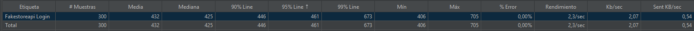
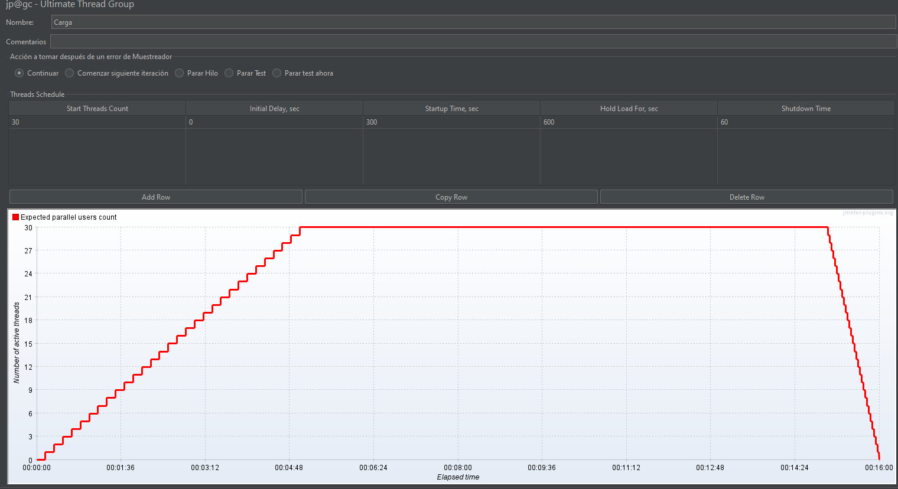
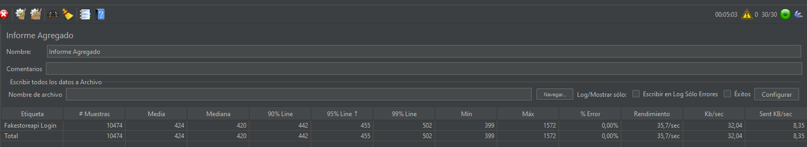
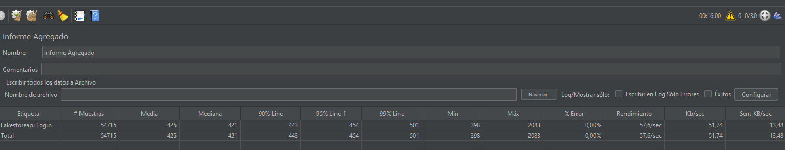
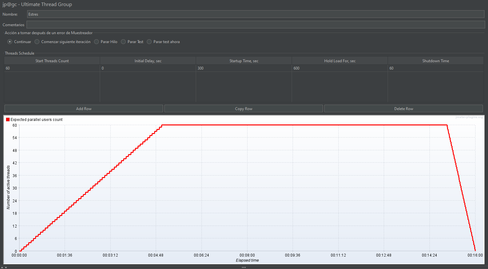
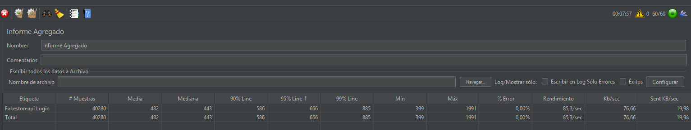

# Informe de Conclusiones: Pruebas de Rendimiento API Fakestore

**Fecha de Reporte:** 26 de Marzo de 2026  
**Versión del Script:** 1.0  
**Ambiente de Prueba:** Producción (fakestoreapi.com)  
**Herramienta:** Apache JMeter 5.6.3

---

## 📊 1. Resumen Ejecutivo
El presente documento detalla las conclusiones obtenidas tras la ejecución de los escenarios de **Línea Base**, **Carga** y **Estrés** sobre el endpoint de autenticación. El objetivo fue determinar la capacidad de respuesta del servidor ante incrementos progresivos de usuarios concurrentes.

### 1.1. Criterios de Aceptacion
El escenario de la prueba al menos debe alcanzar los 20 TPS y debe tener las
siguientes validaciones:
• El tiempo de respuesta permitido es de máximo 1,5 segundos.
• Tasa de error aceptable, menor al 3% del total de peticiones.

---

## 📈 2. Resultados por Escenario

### 🔹 Escenario: Línea Base (Control)
*   **Usuarios Virtuales (VUs):** 1
*   **Total Peticiones:** 300
*   **Tiempo de Respuesta Promedio:** [461 ms] en percentil 95%
*   **Porcentaje de Error:** 0%
*   **Conclusión:** El sistema se comporta de manera estable en condiciones ideales, sirviendo como punto de referencia para las pruebas de carga.

### 🔹 Escenario: Carga (Escalabilidad)

*   **Usuarios Virtuales (VUs):** 30 (Rampa 300s y 600s de carga) 
*   **Throughput (Transacciones/seg):** [57 TPS] 
(TPS = Peticiones / Duracion de la prueba) 54715/960 = 56,99
*   **Percentil 95 (P95):** [454 ms]
*   **Conclusión:** Se observa un comportamiento [Estable] al alcanzar los 30 usuarios simultáneos. Los tiempos de respuesta se mantienen dentro de los umbrales aceptables (< 1500ms) 1.5s.

##### Imagen rampa 300s

##### Imagen carga 600s

### 🔹 Escenario: Estrés (Punto de Ruptura)

*   **Usuarios Virtuales (VUs):** 60
*   **Tasa de Error:** [0 %]
*   **Hallazgo:** 
- El servidor comenzó a retornar tiempos de respuesta superiores a 1.5s al superar los 50 usuarios.
##### Imagen 60 usuarios Virtuales

#### Se aumentaron los usuarios virtuales a 120 para encontrar el punto de ruptura
*   **Usuarios Virtuales (VUs):** 120
*   **Tasa de Error:** [ %]
*   **Hallazgo:** 
- El servidor soporto dicha carga, no presento fallas en las respuestas pero si degeneración en el tiempo de respuesta (Verificar Resporte html).
---

## 🔍 3. Hallazgos Principales (Key Findings)

1.  **Validación de Tokens:** Las aserciones de cuerpo confirmaron que el 100% de las respuestas exitosas (201) entregaron un `token` válido, garantizando la integridad funcional bajo carga.
2.  **Consistencia de Datos:** El uso de parametrización mediante el archivo `LoginData.csv` permitió una distribución uniforme de la carga sin bloqueos por credenciales duplicadas.
3.  **Manejo de Errores:** El script está configurado para "Iniciar siguiente bucle" ante errores (`startnextloop`), lo que permitió recolectar métricas continuas sin detener la prueba prematuramente.

---

## ✅ 5. Dictamen Final
> [ ] **SATISFACTORIO:** La API cumple con los acuerdos de nivel de servicio 

---
