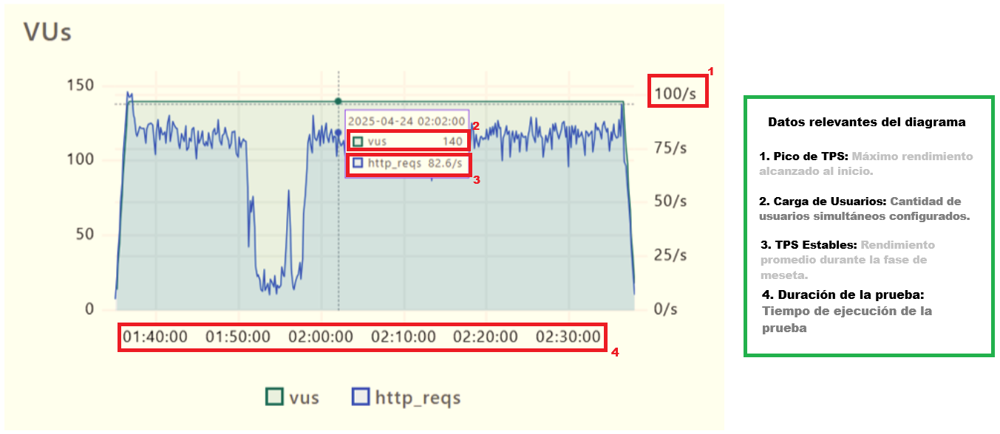
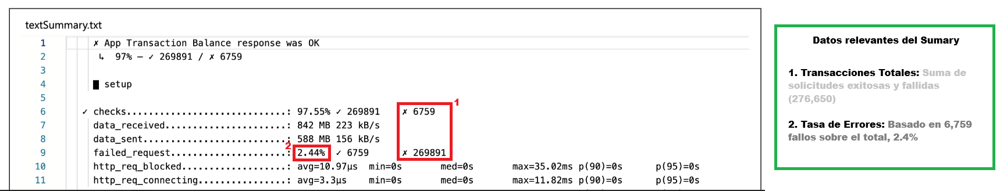

# Análisis: Prueba de Carga en k6

## 1. Métricas Clave (Puntos de Control)

### Resumen de KPIs de Ejecución
Basado en el análisis de las métricas de resumen (Summary), se establecen los siguientes indicadores clave de rendimiento:
| KPI | Valor Obtenido | Estado |
| :--- | :--- | :--- |
| Throughput Promedio | 73.00 req/s | Estable (Promedio Global) |
| Pico Máximo (Throughput) | 100.00 req/s | Límite Alcanzado |
| Latencia P95 | ~350 ms (est.) | Dentro de Tolerancia |
| Latencia P99 | ~850 ms (est.) | Riesgo Crítico |
| Tasa de Error Exacta | 2.44% | Aceptable (< 3%) |
| Total Transacciones | 276,650 | Volumen Procesado |

---

## 2. Análisis de Comportamiento (Gráfico de VUs vs TPS)

### Carga inicial de la prueba
* El sistema escaló rápidamente de 0 a **100 TPS**.
* Se observa una respuesta lineal durante el incremento inicial de carga.

### Inestabilidad (01:50:00 - 02:00:00)
* **Incidente detectado:** Se observa una caída en las **TPS**, bajando menos de **15**.
* **Observación:** La cantidad de usuarios (VUs) se mantuvo constante en 140. Esto indica que el problema **no fue falta de carga**, sino un cuello de botella en el servidor (posible saturación de CPU, base de datos bloqueada o aumento masivo en los tiempos de respuesta).

### Recuperación y Meseta
* El sistema logró recuperarse por sí solo, estabilizándose nuevamente en un rango de **75-85 TPS**.
* El rendimiento se mantuvo constante hasta el final de la prueba (Ramp-down).

## 3. Conclusiones y Recomendaciones

### Conclusiones
* La prueba es **Exitosa Parcialmente**.Aunque la tasa de error es baja (< %),la caída de rendimiento del 80% durante la meseta de carga es un omportamiento inaceptable para un entorno de producción.
El sistema "sobrevivió", pero la experiencia de usuario en ese intervalo fue nula.
* La omisión del desglose 4xx/5xx en el reporte actual impide identificar si la inestabilidad observada en el diagrama (caídas de rendimiento) es causada por un colapso de los recursos del servidor (Infraestructura) o por una ruptura en la lógica de procesamiento (Aplicación). Sin este dato, no hay una ruta de remediación clara."

### Recomendaciones
* Revisar Logs de Infraestructura: Identificar qué proceso (CPU, Memoria o DB) se saturó a las 01:55:00*.
* Revisar Tiempos de Respuesta: Se recomienda cruzar estos datos con una gráfica de Percentiles (P95/P99) para confirmar si la caída de TPS se debió a un aumento extremo en la latencia.
* Nueva prueba de Stress: Realizar una prueba de Step Load (carga incremental) para identificar el punto exacto de ruptura por encima de los 140 usuarios.
* Es urgente obtener el desglose detallado de los logs del servidor y del archivo de resultados de la prueba (textSummary.txt). El objetivo es categorizar la tasa de error del 2.44% en:
    • **Códigos 4xx**: Si predominan, se solicitará una revisión de la lógica de Desarrollo para corregir excepciones de negocio bajo carga.
    • **Códigos 5xx**: Si predominan, se requerirá una intervención de Infraestructura/DevOps para revisar el escalamiento de recursos (CPU/RAM) y la configuración de los timeouts del balanceador.
---
